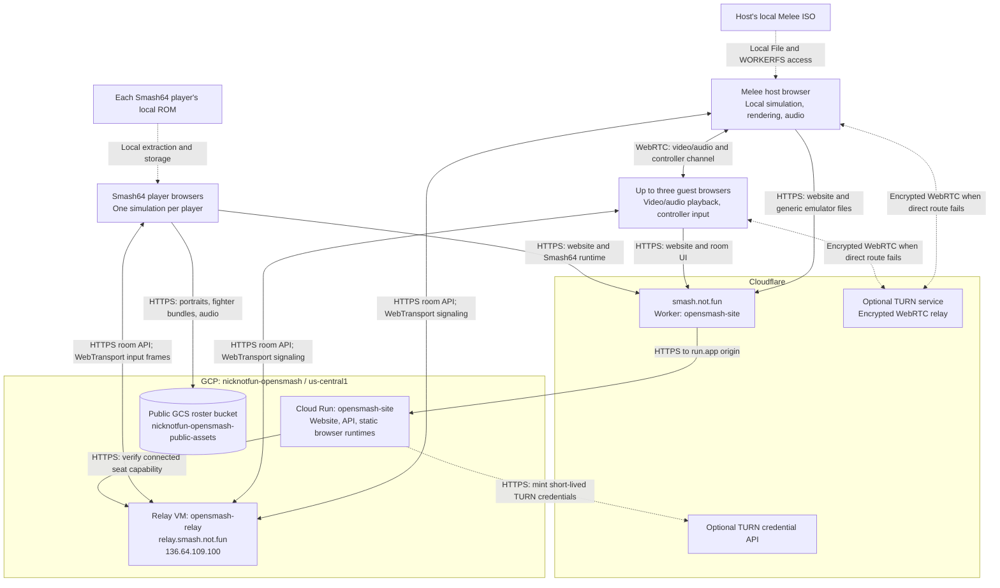
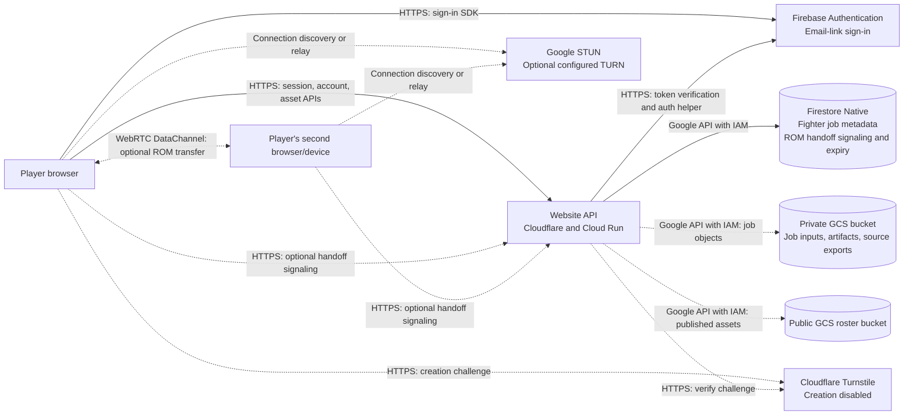
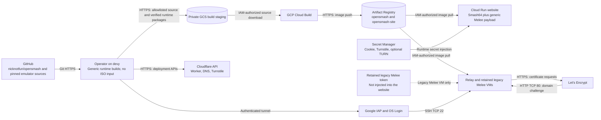
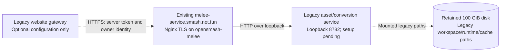

# Network architecture of smash.not.fun

Architecture update: **2026-09-15**. GCP project **`nicknotfun-opensmash`**,
region **`us-central1`**, VM zone **`us-central1-a`**. See [LIVE.md](LIVE.md)
for deployed revisions, verification results, resource sizes, and costs.

The website, public roster, WebTransport relay, and Smash64 runtime are deployed.
**Browser-hosted Melee preview is live** on Cloud Run revision
`opensmash-site-00005-tml` with its generic four-controller runtime. The module
and an actual Chromium worker loaded from the public website passed disc-free
shared-memory checks; four live browsers also
passed media, controller, signaling, and guest-rejoin checks. Actual Melee
gameplay and latency still require validation with a player's local ISO. TURN
credentials are pending; the deployed ICE provider currently uses STUN only. See
[Melee hosting](MELEE_HOSTING.md) for the implementation and qualification plan.

## 1. Website, gameplay, and assets

Cloud Run serves the website, APIs, and static emulator files. The browsers run
the games. The two multiplayer modes use different gameplay paths:

| Mode | Who runs the simulation? | Gameplay traffic | Game files |
| --- | --- | --- | --- |
| Smash64 `lockstep` | Every player | Each browser sends controller inputs to the WebTransport relay; the relay broadcasts complete frames | Every player selects their own local ROM |
| Melee `host-stream` | The primary player's browser | Host sends WebRTC video/audio; guests return controller inputs over a WebRTC data channel | Only the host selects a local ISO; guests need no game files |

Melee's host simulation runs in a browser worker independently of input sampling
and video presentation. GCP does not execute Melee or store the host's ISO.
WebRTC uses a direct browser connection when possible and optional TURN when a
direct connection cannot be established. TURN forwards encrypted traffic.

Solid arrows are normal request/data paths. Dashed arrows are local file access
or optional connections. The Melee paths describe the live preview. TURN remains
optional and unconfigured; check [LIVE.md](LIVE.md) for current qualification.

### How a Melee link works

1. The host opens `/melee` and creates a room with `mode:"host-stream"`.
   The relay generates a random 128-bit game ID. Its invitation is
   `https://smash.not.fun/melee?game=<id>`.
2. The host and guests receive separate seat credentials and connect directly
   to `/v1/connect` over WebTransport. The invitation contains only the room ID.
3. The host selects a local USA 1.02 ISO. The same-origin iframe at
   `/melee/browser-runtime/index.html` runs a generic Dolphin browser runtime;
   its worker reads the local file. The ISO is never uploaded.
4. Only the host prepares the engine and starts the room. Guests do not load
   an emulator, choose an ISO, or submit an engine/content fingerprint.
5. The host offers a WebRTC connection to each guest. The relay forwards SDP
   and ICE only between that host and the intended authenticated guest. Seat
   generations and host-generated negotiation IDs reject obsolete messages.
6. The host sends captured video/audio and receives each guest's controller
   state on that connection. If TURN is configured, `/api/netplay/ice` verifies
   the connected seat with the relay before issuing short-lived credentials.
7. Guests can join an already running game. A departing guest's controller is
   neutralized and its seat becomes available. The host's departure ends the
   game; the simulation is not migrated to another player.

Smash64 keeps its existing lockstep flow: players agree on matching engine/game
fingerprints, prepare a shared configuration, and submit controller inputs for
each tick. The relay waits for every occupied seat before broadcasting that
frame. Every browser advances its own simulation and presents it separately.
This mode has no rollback or input prediction.

Multiplayer rooms live in the **single relay process's memory**. Firestore does
not persist these rooms. Restarting the relay ends its games. Ended snapshots
remain for up to five minutes and can be reclaimed sooner at capacity; active
rooms are not evicted to make space. The relay has no emulator or ISO access.

### DNS, TLS, and listening ports

| Entry point | Network route | Purpose |
| --- | --- | --- |
| `smash.not.fun` | Cloudflare Worker → public Cloud Run HTTPS origin → container 8080 | Website, APIs, and browser runtime files |
| `relay.smash.not.fun` | DNS-only A record → VM TCP/UDP 443 → container 8443 | HTTPS room API and WebTransport lockstep/signaling |
| Optional TURN endpoints | Browser directly to the URLs supplied by the TURN provider | Encrypted WebRTC fallback; independent of Cloud Run and the Go relay |
| `storage.googleapis.com/nicknotfun-opensmash-public-assets` | Browser directly to GCS over HTTPS | Public roster assets |
| `melee-service.smash.not.fun` | DNS-only A record → legacy VM TCP 443 → Nginx → loopback 8782 | Existing legacy conversion service, unused by browser-hosted Melee |
| Existing VM addresses, TCP 80 | Public firewall rule; Certbot challenge listener | Let's Encrypt certificate issuance/renewal |
| Existing VMs, TCP 22 | Google IAP source range `35.235.240.0/20` only | Operator SSH through IAP and OS Login |

Cloudflare terminates website TLS; Cloud Run has its own Google-managed HTTPS
endpoint. The VMs use publicly trusted Let's Encrypt certificates. Their DNS
records bypass Cloudflare's HTTP proxy. Cloud Run and the website Worker do not
carry WebTransport UDP or act as TURN. The Cloud Run origin is also public.

The Worker preserves browser isolation headers and disables shared CDN caching
for proxied responses. The Melee iframe is frameable only by the same origin and
requires cross-origin isolation for shared memory. Its handler serves only
manifest-listed files whose hashes and four-controller Wasm capability pass
validation. Public content-addressed GCS roster files have their own cache policy.

## 2. Sign-in, storage, and optional ROM handoff

These services support the website and are outside the gameplay input/media
paths. Melee room signaling uses the Go relay, not Firestore handoff rooms.

- **Firebase:** `/api/auth/session` exchanges a browser ID token for a website
  session cookie. `/__/auth/*` proxies Firebase's hosted helper. Email-link
  sign-in is configured; a complete login still needs live qualification.
- **Firestore and GCS:** the website accesses these with service-account IAM.
  `handoffRooms` stores the separate ROM-transfer negotiation with a TTL policy.
  Fighter generation is disabled and no generation worker is deployed. The
  public bucket contains 7,322 roster files for 1,046 fighters.
- **ROM handoff:** the optional Smash64 device-transfer feature sends ROM bytes
  over a WebRTC data channel. It shares the STUN/TURN credential provider but has
  its own signaling and authorization. It does not provision Melee or send its
  host ISO to guests. TURN is optional; consult [LIVE.md](LIVE.md) for its current
  deployment status.
- **Turnstile and generation APIs:** Turnstile is configured for disabled fighter
  creation. Joining a game does not require it. OpenAI, Tripo, and fal generation
  services are outside the active deployment.

## 3. Build, deployment, and administration

The generic Melee runtime is built from pinned open-source inputs on devy.
Neither that build nor its Cloud Build upload accepts a game disc, extracted
workspace, save state, or game-derived executable. Its manifest hashes the
emulator files and accompanying source archive. The website deployment verifies
those hashes, rejects symlinks/unlisted files, and checks the actual Wasm
four-controller capability before staging and again inside the image build.

Cloud Build has a separate build service account; the website and VMs have
separate runtime identities. VM startup uses metadata-service credentials for
image pulls and, on the legacy Melee VM, Secret Manager. Neither the relay nor the current website revision receives that legacy token. Cloud services log to Cloud Logging; VM services use systemd
and bounded Docker logs. Player tokens must never appear in request logs.

For a website image containing both runtimes, pass **both** `--ssb64-runtime`
and `--melee-browser-runtime` to `deploy/gcp/site.py`. They become separate named
build contexts and the `with-games` Docker target. Omitting a runtime does not
copy it from the previously deployed image. See [GCP deployment](gcp/README.md).

## 4. Retained legacy Melee service

`opensmash-melee` and its 100 GiB data disk already exist. This service belongs
to the earlier game-derived browser build and custom-fighter conversion path.
It is **not a dependency of `/melee` browser hosting**. The deployed website
configuration omits its service origin and token. Its missing private
workspace must not be filled to enable the new route. The existing endpoint
remains unconfigured; retirement is pending actual browser gameplay qualification.
No VM, disk, or address has been removed by the browser-hosting changes.

The legacy gateway uses `/melee/engine/*` and `/melee/api/*`. It strips browser
credentials and adds a server-held token and owner identity. Those optional
service settings must be supplied together. The new browser runtime uses
`/melee/browser-runtime/*` and `/api/melee/browser` and requires neither setting.

## Source references

- [Website deployment and runtime staging](gcp/site.py)
- [Generic runtime build](../engines/melee/tools/build_browser_dolphin.py)
- [Runtime verification and static serving](../web-prototype/server/melee-browser-runtime.js)
- [Browser room API and WebTransport client](../web-prototype/shared/netplay-client.js)
- [Relay protocol and limits](../netplay/relay/README.md)
- [WebRTC host/guest transport](../web-prototype/shared/host-stream.js)
- [Connected-seat ICE authorization](../web-prototype/server/netplay-ice.js)
- [Worker proxy](cloudflare/worker.mjs) and [VM provisioning](gcp/deploy.mjs)
- [Legacy Melee gateway](../engines/melee/server/handler.mjs)
- [Firebase auth](../web-prototype/server/auth.js), [ROM handoff](../web-prototype/server/handoff-rooms.js), and [STUN/TURN provider](../web-prototype/server/handoff-ice.js)
- [Live deployment inventory](LIVE.md)
