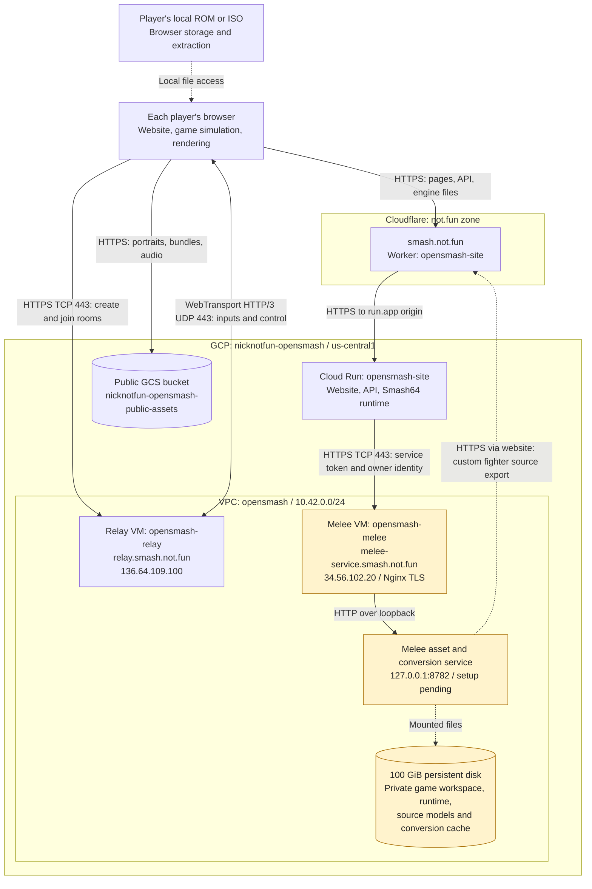
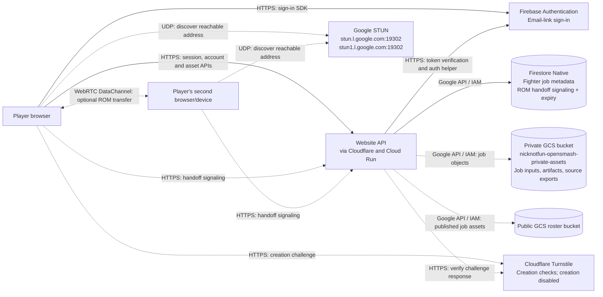
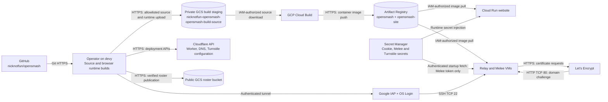

# Network architecture of smash.not.fun

Deployment snapshot: **2026-09-15**. GCP project **`nicknotfun-opensmash`**,
region **`us-central1`**, VM zone **`us-central1-a`**. See [LIVE.md](LIVE.md)
for deployed image digests, verification results, resource sizes, and costs.

Each player runs the game simulation and rendering in their browser. The
WebTransport relay coordinates players and distributes controller inputs.
Cloud Run serves the website/API and browser runtime; it does not simulate games.

## 1. Website, game traffic, and assets

Solid arrows show request/data paths. Dashed arrows show a conditional path or
local file access. The orange Melee components are provisioned but await game
setup; their public HTTPS endpoint currently returns 503.

### How a shared game starts

1. A player opens `smash.not.fun`. Cloudflare forwards the request to Cloud Run.
   The browser downloads public fighter assets directly from GCS.
2. The browser reads `/api/netplay/config` from the website, then calls the
   relay's `/v1/rooms` API directly. The relay creates a random 128-bit game ID.
3. The invitation is `https://smash.not.fun/?game=<id>` for Smash64 or
   `https://smash.not.fun/melee?game=<id>` for Melee. Up to four players join and
   receive separate seat credentials; those credentials are not in the link.
4. Each browser connects directly to the relay's `/v1/connect` over WebTransport.
   Players agree on compatible engine/content identities and a shared game
   configuration before starting. The relay distributes ordered input frames.
5. Each browser advances its own simulation from those inputs. Rendering has
   its own schedule. ROM/ISO bytes do not travel over the gameplay connection.

Multiplayer rooms and their input history live in the **single relay process's
memory**. Restarting that process ends its games. Firestore does not persist
these multiplayer rooms, and the relay does not run a game engine.

### DNS, TLS, and listening ports

| Entry point | Network route | Purpose |
| --- | --- | --- |
| `smash.not.fun` | Cloudflare Worker → public Cloud Run HTTPS origin → container port 8080 | Website, API, Smash64 runtime; browser requests for Melee also enter here |
| `relay.smash.not.fun` | DNS-only A record → VM TCP/UDP 443 → container 8443 | HTTPS room API and WebTransport gameplay |
| `melee-service.smash.not.fun` | DNS-only A record → VM TCP 443 → Nginx → loopback 8782 | Website-to-Melee authenticated asset/conversion requests |
| `storage.googleapis.com/nicknotfun-opensmash-public-assets` | Direct HTTPS to GCS | Public roster assets; independent of the website Worker |
| Both VM addresses, TCP 80 | Public firewall rule; Certbot HTTP challenge listener | Let's Encrypt certificate issuance/renewal |
| Both VMs, TCP 22 | Only Google IAP source range `35.235.240.0/20` | Operator SSH through IAP and OS Login |

Cloudflare terminates website TLS; Cloud Run has its own Google-managed HTTPS
endpoint. Each VM uses a publicly trusted Let's Encrypt certificate. The relay
and Melee DNS records bypass Cloudflare's HTTP proxy. Cloud Run's origin is also
publicly reachable; there is no private VPC connector for its Melee requests.

The Melee service is **authenticated, not isolated behind a private IP**. The
website gateway removes browser cookies and authorization headers, then adds its
server-held service token and an account/guest owner identity. Browser requests
use `/melee/engine/*` and `/melee/api/*` on `smash.not.fun`. The hosted service
rejects disc-upload, raw game-file, debug, and native-process routes.

The Worker preserves browser isolation headers and disables shared CDN caching
for proxied responses. Public engine files can still use browser caching;
content-addressed GCS roster files have their own cache policy.

## 2. Sign-in, durable storage, and optional ROM handoff

These services support the website; they are not on the per-frame gameplay path.
Dashed arrows below represent optional user actions or features that are
configured but disabled.

- **Firebase:** the browser obtains an ID token, then `/api/auth/session`
  exchanges it for the website's session cookie. `/__/auth/*` is proxied through
  the website to Firebase's hosted helper. Email-link sign-in is configured;
  a complete email-link login has not yet been live-tested.
- **Firestore and GCS:** the website uses service-account IAM to access them.
  Firestore `handoffRooms` stores WebRTC negotiation messages with a TTL expiry
  policy. Fighter job metadata and private object storage are configured, but
  the fighter-generation worker is not deployed and creation is disabled.
  The public bucket already contains 7,322 roster files for 1,046 fighters.
- **ROM handoff:** the existing optional Smash64 device-transfer feature uses
  HTTPS/Firestore only for signaling. ROM bytes use a browser-to-browser
  WebRTC DataChannel. Google STUN helps discover a direct route. No TURN relay
  is configured, so some networks cannot establish this optional connection.
  This is separate from WebTransport multiplayer and does not provision Melee.
- **Turnstile:** configured for fighter creation, which is currently disabled.
  It is not a requirement for joining a game. OpenAI, Tripo, and fal generation
  services are not part of the active deployment.

## 3. Build, deployment, secrets, and administration

These connections run during deployment, startup, maintenance, or certificate
renewal. They do not carry controller frames.

Cloud Build uses a separate build service account; the website and each VM have
separate runtime identities. VM startup uses Google's metadata service to obtain
short-lived credentials for image pulls and, on the Melee VM, Secret Manager.
The diagram groups both VMs for space; the relay does not receive the Melee token.
Cloud Build and Cloud Run also emit operational logs to Cloud Logging; VM
services use systemd/Docker logs with bounded Docker log rotation.

**Game-file boundary:** Smash64's browser runtime is built and hosted without a
ROM. Each player selects a local US v1.0 ROM. Melee's current build needs one
private USA 1.02 ISO to compile its executable into the browser runtime and
prepare the verified workspace. That workspace and its runtime inputs belong on
the Melee data disk, outside public buckets and ordinary container build inputs.
Each Melee player still selects a matching local ISO. Original Melee fighters
avoid conversion; custom fighters additionally need their original rigged models.

The website, roster, relay, and Smash64 runtime are deployed. Melee's VM/TLS are
provisioned, but its runtime/workspace still await an ISO. Runtime startup and
multiplayer input transport have passed live checks; actual ROM gameplay remains
to be validated.

## Source references

- [Worker proxy and caching](cloudflare/worker.mjs)
- [Website deployment and service-account configuration](gcp/site.py)
- [VPC, firewall, and VM provisioning](gcp/deploy.mjs)
- [Relay startup and TLS](gcp/relay-startup.sh.tmpl)
- [Melee startup, disk mounts, and TLS](gcp/melee-startup.sh.tmpl)
- [Browser room API and WebTransport client](../web-prototype/shared/netplay-client.js)
- [Melee website gateway](../engines/melee/server/handler.mjs)
- [Firebase session and auth-helper routes](../web-prototype/server/auth.js)
- [ROM handoff signaling](../web-prototype/server/handoff-rooms.js) and [STUN/TURN configuration](../web-prototype/server/handoff-ice.js)
- [Deployment commands](README.md) and [live inventory](LIVE.md)
