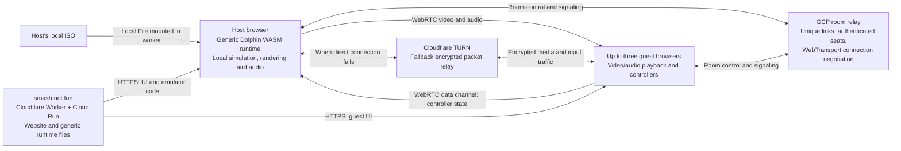

# Melee hosted entirely in the browser

Status: **browser preview, 2026-09-15**. The generic runtime is built and its
four-controller ABI, worker and browser transport checks pass. Actual Melee
gameplay remains unqualified without a locally selected ISO. See [LIVE.md](LIVE.md)
for the actual deployed inventory.

## How it works

The primary player runs Melee in their browser using a local USA 1.02 ISO.
Up to three guests open a unique invitation link, receive game video/audio,
and send controller state. Only the host simulates the game. Nobody installs
an app. No cloud build or service receives an ISO, extracted game files, or
statically translated game code.

The public invitation contains a random room ID, never a seat credential.
The host is Player 1. Each guest receives one seat capability, and connection
generations prevent negotiation from an earlier occupant reaching a new one.
Guests do not load an emulator or provide an ISO.

## Why the runtime changes

The previous browser engine statically compiles `main.dol` into a game-specific
WASM module during its build. Moving networking to a host alone would retain
that game-data dependency.

This variant uses [wasm-dolphin](https://github.com/dougchansan/wasm-dolphin),
pinned to `7e38409ace3dda709c178312ff63fd92a3653cc7`. Its generic runtime reads a
local ISO through WORKERFS and translates PowerPC instructions inside the
browser. Its native build inputs are open-source emulator/compiler code.
OpenSmash adds four controller ports to its original one-port bridge.

The [build instructions](../engines/melee/runtime/browser-dolphin/README.md)
record the pinned source, patches and Linux toolchain. Packaging verifies the
rebuilt artifacts, rejects the original single-port binary, includes the
corresponding source archive and license, and emits a file/hash manifest.
The deployment validator checks the actual WASM exports and the complete
publication tree. Game files and compiled game caches are not deployment inputs.

The host iframe uses a fixed runtime profile, independently of invitation URL
parameters. It skips the upstream demonstration initialization and requires
successful disc boot plus advancing game frames and ticks before marking the
host ready. A demo image or an accepted boot request is not gameplay proof.

## Rooms, simulation and media

`host-stream` is an explicit Melee room mode. Existing lockstep games retain
their own protocol. A streaming host prepares, becomes ready and starts; guests
can join before or after startup. Only the host boots/fingerprints game data.
Guest departure leaves the game running and clears that controller. Host
departure ends the room. There is no automatic host migration or ISO transfer.

The emulator runs in its worker, while presentation and stream encoding have
their own schedules. Controller sampling runs on an independent timer and key
events; it does not advance simulation or wait for a rendered frame.

WebTransport carries room state and targeted WebRTC offers, answers and ICE
candidates. The relay authorizes host-to-guest and guest-to-host messages,
fences them by connection generation and negotiation nonce, and bounds message
size, rate and queued bytes. Guests cannot negotiate with another guest.

WebRTC carries canvas video, game audio and a controller data channel. Complete
controller states have sequence numbers and bounded buffering. Older packets
are dropped. The host clears a guest's controls after 300 ms without a fresh
state, on disconnect, and on peer replacement. The host chooses the controller
port from the authenticated peer; a guest packet cannot select someone else's
port. Local mute affects the host's speakers while guest audio continues.

One peer connection per guest keeps the first implementation small. Host upload
and encoding load grow with guest count. TURN forwards encrypted packets when a
direct route cannot connect; it does not reduce the number of host streams.

## Website and deployment

- `/melee` provides browser hosting. Every created game has a fresh
  `/melee?game=<random-id>` link.
- `/api/melee/browser` reports runtime availability.
- `/melee/browser-runtime/*` serves only the validated generic runtime's files.
  Its embedded host page is restricted to same-origin framing.
- `/api/netplay/ice` obtains short-lived TURN credentials only after verifying a
  currently connected streaming seat with the configured relay.
- `OPENSMASH_MELEE_BROWSER_ROOT` selects the validated local runtime directory.
  The deployment command accepts `--melee-browser-runtime` alongside
  `--ssb64-runtime`; preserve both on repeat deployments.

Cloudflare Realtime TURN needs a separate key. The existing DNS token was
checked and returned HTTP 403 for TURN configuration. Use a TURN key's ID and
API token; put the token in Secret Manager. `cloudflareTurnKeyId` and
`cloudflareTurnSecret` configure its public ID and numbered secret reference.
The account permission for creating TURN keys through the API is
[Calls Write](https://developers.cloudflare.com/api/resources/calls/subresources/turn/methods/create/).

This route has no dependency on `melee-service.smash.not.fun`, its private game
workspace, custom fighter conversion, or its service token. The legacy Melee
service can be omitted from new website configuration. Its existing VM and
retained disk should be retired only as a separate deployment cleanup after
browser gameplay is qualified; implementation does not delete them.

## Validation and remaining limits

Tests cover room permissions/lifecycle, signaling bounds, controller isolation,
stale/reordered inputs, audio/video cleanup and cancellation. Synthetic media
checks use separate Chrome processes, the real Go WebTransport relay and the
production room client. They verify decoded changing video, audio, controller
delivery, late guests, reconnects and released controls without game data.
Runtime checks additionally instantiate the actual WASM and exercise all four
controller ports without an ISO.

Actual Melee boot, sustained game speed, visual/audio correctness and
controller-to-display latency still need testing with a user's local ISO.
The emulator allocates **1.5 GiB of shared WASM memory**. Browser support,
available memory and graphics hardware matter; mobile support and stable
60 FPS are not established. Start with the original Melee roster. Custom skins
and direct match-selection hooks are separate integrations.

Guests incur network, encoding and decoding delay while the host has local
controls. Evaluate distinct game frames and game clock progress, not only the
rate at which a screen repaints. A reliable release also needs a TURN-only
integration test with configured credentials.

## Implementation references

- [Pinned generic runtime and build](../engines/melee/runtime/browser-dolphin/README.md)
- [Room protocol](../netplay/relay/README.md)
- [Browser room client](../web-prototype/shared/netplay-client.js)
- [Media and controller transport](../web-prototype/shared/host-stream.js)
- [Browser host/guest UI](../web-prototype/src/MeleeStreamGame.jsx)
- [Local runtime adapter](../web-prototype/public/melee-browser-host-runtime.js)
- [Authenticated ICE credentials](../web-prototype/server/netplay-ice.js)
- [WebRTC specification](https://www.w3.org/TR/webrtc/)
- [Cloudflare TURN service](https://developers.cloudflare.com/realtime/turn/)
