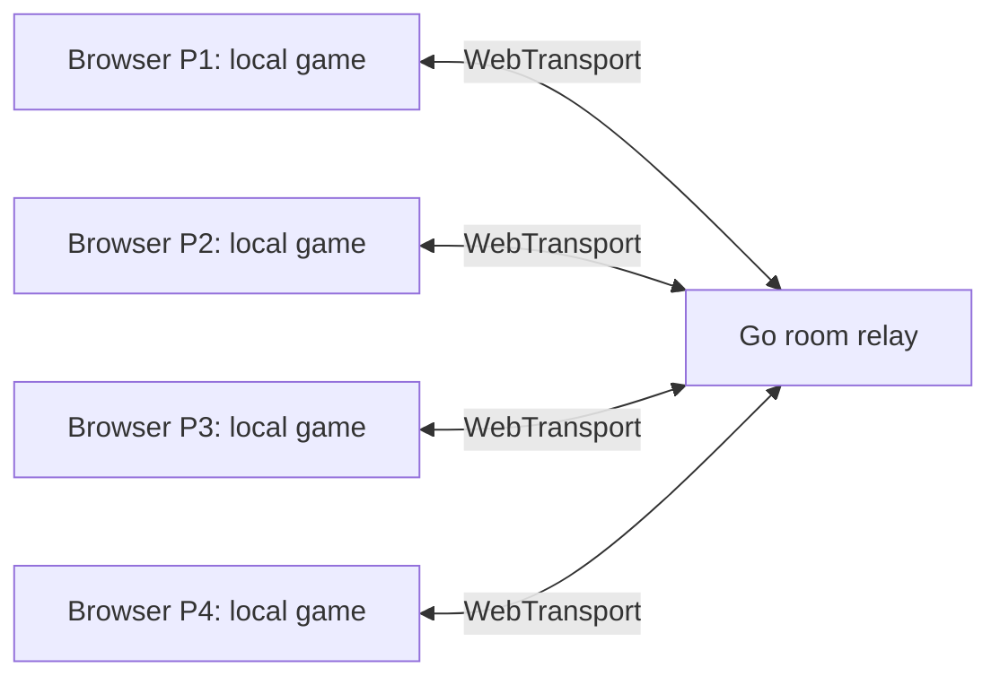

# WebTransport multiplayer

This fork adds browser rooms for Smash 64 and Melee. A browser launch creates a
fresh, unguessable game link. Up to four people join, the host freezes the player
list with **Prepare game**, each browser prepares the same game, and the host
starts after every player reports a matching runtime/content fingerprint.
Unoccupied slots become CPUs. Every new match launched from the roster creates a
new room; invitation links never contain host or player credentials.

This is a source implementation with automated transport and simulation-gate
tests. **A rebuilt game runtime and actual multi-browser matches are still
required before a gameplay release.** Existing compiled engines deliberately
refuse online play until rebuilt. No production deployment is performed by this
change.

## Player flow

1. Select a fighter in the browser launcher. A new room link is created.
2. Open the room and choose **Join game**; copy its invitation link to friends.
3. Once everyone has joined, the host chooses **Prepare game**. The player list
   is fixed from this point. Each participant supplies their own local ROM/disc.
4. The engines compare their prepared content fingerprints. The host can start
   when all players are ready.
5. Each browser controls its assigned player using its first connected gamepad,
   or the keyboard when no gamepad is connected. Existing engine-specific button
   mappings apply. Online games use direct VS matches with the host's lineup.

Joining an already prepared/running room is rejected. Disconnects end the match;
there is no mid-match reconnection, host migration or spectator mode. Local
native desktop play retains its existing launch path. This WebTransport variant
targets the browser runtimes, independently of native Melee's ENet netplay.

## How synchronization works



The HTTPS API reserves rooms/seats; an HTTP/3 WebTransport connection carries an
ordered reliable JSON stream for room control and controller frames. The relay
authenticates each seat separately, collects its input for a particular tick,
and broadcasts the same complete four-controller frame to every participant.
Clients sample inputs three frames ahead to hide part of the round-trip delay.

Both engines now gate their simulation at an emulated video-frame boundary.
They wait for the confirmed frame before advancing and ignore ordinary local
input injection during online play. Common startup state, seeds, launch choices
and content fingerprints reduce sources of divergence. The relay handles no
ROM bytes, video, game-state simulation or character generation.

This is delay-based lockstep, with no rollback. Slow clients or network loss
pause everyone; the client and relay terminate stalled matches. Input agreement
alone does not prove complete engine determinism. Cross-browser gameplay,
CPU/GPU performance and long-running matches remain release checks. Fingerprints
are compatibility checks, not anti-cheat attestation.

### Simulation ticks and display refreshes

A protocol `frame` means one **emulated simulation tick**, not a browser redraw.
Input confirmation gates that tick; it does not wait for `requestAnimationFrame`
or a canvas presentation acknowledgment. Display refreshes cannot consume an
input twice, skip a simulation tick, or let the game advance without every
player's input.

- **Smash 64:** the online loop waits asynchronously for confirmed inputs and a
  fixed 60 Hz timer deadline before entering the synchronous game tick. Online
  pacing bypasses the original browser animation-frame wait. Catch-up is bounded
  after a stall without dropping game ticks. The browser compositor displays the
  latest completed canvas image independently.
- **Melee:** the emulated CPU waits at the console's video-interface boundary;
  its clock already runs independently of browser animation callbacks. Completed
  images pass through bounded mailboxes to a separate animation-frame presenter.
  Slow or absent presentation drops stale images instead of blocking the CPU or
  accumulating images. Presentation credits control image transfers only.

This separates input/simulation scheduling from **display presentation**. Both
engines still execute guest graphics work that reads live game memory and can
affect emulated timing. Moving that work onto an independent renderer requires
captured graphics state and further engine validation. GPU cost can still limit
simulation speed, and browser background throttling can still slow a player.

### Code map

- `netplay/relay/`: TLS/HTTP3 server, room lifecycle, authenticated input barrier,
  resource bounds, real QUIC tests, Dockerfile and protocol documentation.
- `web-prototype/shared/netplay-client.js`: WebTransport connection, delayed input
  pipeline, confirmed-frame queue, cancellation and invitation credentials.
- `web-prototype/shared/netplay-launch.js`: shared lineup and frozen player roles.
- `web-prototype/src/NetplayGame.jsx`: invitation, preparation and gameplay UI.
- `engines/ssb64/netplay/`: pinned BattleShip/decomp patches, frame gate and isolated
  build driver. `web-prototype/public/ssb64-netplay.js` connects the iframe.
- `engines/melee/runtime/web/netplay*` and browser patch `0007`: Melee frame gate,
  startup fingerprint and worker/controller protocol.
- `engines/melee/runtime/web/presentation.mjs`: bounded image transfer and an
  independent presenter that keeps the latest completed image.

## Deployment inputs needed

### 1. Site and relay hostnames

For example, `game.example.com` for the existing Node site and
`relay.example.com` for the relay. Set on the website:

```sh
OPENSMASH_NETPLAY_URL=https://relay.example.com
```

This becomes a public, read-only `/api/netplay/config` response. Missing relay
configuration produces a visible setup error when creating an online game.
HTTPS and a browser exposing `WebTransport` are required. The website keeps its
existing cross-origin isolation headers for the Wasm worker/shared memory.

### 2. One relay VM/LXC or container, with TLS and UDP

The relay needs **TCP 443 and UDP 443** reachable at its hostname and a publicly
trusted certificate/full chain plus private key. A conventional HTTP proxy or
the website's Cloud Run endpoint cannot forward this QUIC service. Route it
directly or through a load balancer explicitly supporting the required QUIC
traffic. DNS for this hostname must reach that endpoint.

`netplay/compose.yaml` packages the relay. Supply `RELAY_ALLOWED_ORIGINS` as the
exact site origin and mount the certificate directory read-only. The non-root
container reads certificates as UID 65532. Renew certificates and restart the
relay to load them; restarting ends active rooms in this version.

```sh
cd netplay
cp .env.example .env
# Fill in the website origin and certificate directory, then:
docker compose up --build -d
```

Room state lives in memory, with up to 256 rooms/four players per room and a
four-hour maximum lifetime. Begin with one relay instance. Multiple replicas
need explicit room ownership/routing before horizontal scaling. No database or
cloud credentials are required by the relay. Its startup/health logs omit player
tokens; do not add proxy access logs containing the WebTransport connect query.

### 3. Rebuilt browser engines and game fixtures

- **Smash 64:** the pinned BattleShip checkout/submodules, Emscripten and your US
  1.0 ROM. Run `engines/ssb64/netplay/build.py` and point the website's
  `OPENSMASH_ENGINE_ROOT` at its generated `web-dist`. Details in
  [the SSB64 build guide](../engines/ssb64/netplay/README.md).
- **Melee:** your unmodified US 1.02 ISO/GCM and the pinned recompiler toolchain;
  rebuild the browser runtime with the new patch. Details in
  [the Melee runtime guide](../engines/melee/docs/WEBTRANSPORT.md).
- Publish identical versioned engines and public character assets to all players.
  The online launcher uses the unauthenticated public roster and rejects private
  selections; automatic opponents never include the host's private fighters.
  Room membership does not grant site-account access.
- The site retains its existing roster/auth/creation service configuration;
  those deployments are separate from this relay. Game files remain local to
  players and must not be included in public images or CI artifacts.

## Verification

```sh
cd web-prototype
pnpm install --frozen-lockfile
pnpm test
pnpm build

cd ../engines/melee/web
npm ci
npx tsc --noEmit

cd ../../..
node --test engines/melee/tests/netplay*.test.mjs engines/melee/tests/presentation.test.mjs
g++ -std=c++20 -pthread -Wall -Wextra -Werror engines/melee/tests/netplay_gate.cpp -o /tmp/melee-netplay-gate
/tmp/melee-netplay-gate
python3 -m unittest discover -s engines/ssb64/netplay -p 'test_*.py'

cd netplay/relay
go test -race ./...
```

The website tests cover invitations, ownership, input delay, exact frame delivery,
bad packets, missing frames, disconnects, engine startup capabilities and launch
roles. C++ tests run the actual simulation gates without ROMs. The relay suite
uses real local TLS, UDP, HTTP/3 and WebTransport streams as well as adversarial
room/lifecycle tests. See `netplay/tests` for the browser transport smoke test.
That test also runs the actual presentation mailbox with independently scheduled
30/60/144 Hz display callbacks and a fourth client with no display callbacks.
All four synthetic simulations must complete identical ticks and release their
images. This does not substitute for measuring actual engine rendering.

Before release, run two-, three- and four-browser matches with the rebuilt game
assets: shared seed/lineup, controls per seat, stocks/results, audio, background
tabs, delayed/lost traffic and disconnects. Measure Melee's online CPU/GPU mode
on actual devices. Automated synthetic input tests do not replace those matches.
